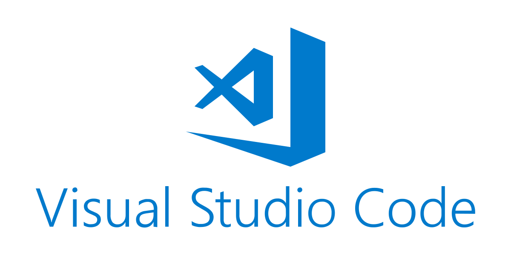

### **기존 git에서 스타일 통일을 위해서 여기(현재git)로 이사함.**

기존git => https://github.com/juhyunKIM90/toto.git 

 

### **노션으로 생성하고 수정한 마크다운이라서 아래의 노션링크으로 보시면편합니다.**
프로젝트 노션으로보기
[https://dent-mandrill-d55.notion.site/Team-Project-Green-Sports-b4cbcfe7da41422ead997f514082dc06?pvs=4](https://dent-mandrill-d55.notion.site/Team-Project-Green-Sports-cd9401cde46c47009e3e169c83e476ea)

 

># Team Project : Green Sports

### GitHub Ropository

<aside>
 

[https://github.com/gogiari/toto2.git](https://github.com/gogiari/toto2.git)

 
 

</aside>

># 프로젝트 소개
### 저희 홈페이지 Green Sports는 스포츠 커뮤니티로 유저끼리 서로 소통하고, 이야기 나누는 사이트 입니다.
수업내용에서는 주로 Eclipse에서 Spring, Maven, JSP 을 다뤘지만, 팀원들의 의견 합의 하에 Visual Studio Code에서 Spring Boot, Gradle, Thymleaf를 다뤄보았습니다.

 
 

># **개발환경**

 

## IDE & Tools
---
&nbsp;&nbsp;
&nbsp;&nbsp;

 
 

## Languages
---

### Programming Language

 

### Programming Language

 

### Markup Language

 

### Stylesheet Language

 
 
 

## Framework & Libraries
---
&nbsp;&nbsp;
&nbsp;&nbsp;
&nbsp;&nbsp;
&nbsp;&nbsp;

 
 
 

## Database Management System
---
&nbsp;&nbsp;
&nbsp;&nbsp;

 
 
 

## Version Control & Repository
---
&nbsp;&nbsp;

 
 
 

## Event Streaming Platform
---

Messaging System

 
 
 

## Web Development Technologies
---

 
 
 

># 팀원

### **박성완**

- Oracle Cloude DB를 이용한 환경 구성
- Summernote를 활용한 게시판 및 갤러리 구현
- session을 통한 로그인 수정
- Ajax를 활용한 비동기 댓글

### **이창경**

- Kafka를 활용한 채팅 기능 구현
- 뉴스 페이지 크롤링
- 로그인
- 메인 화면 기능 구현

### **송지훈**

- 홈페이지 디자인 및 구성
- 회원 리스트
- 회원 가입
- 메인 화면 수정
- 발표

### **김주현**

- 홈페이지 디자인 및 구성
- 게시판 기능 구현
- 게시판 디자인
- PPT 제작

 
 
 

># **페이지**

 

## 📄 홈페이지

---

비로그인시 홈페이지

<aside>
🗨️ 기본 홈페이지 화면. 간단하게 로그인화면, 메인이미지, 유저리스트, 광고이미지로 구성함
</aside>
 
 
 

로그인시 홈페이지

 
 
 

## 📄좌측 채팅창의 모습

---

kafka를 활용한 채팅을 주고 받는 모습

kafka채팅 서버 실행

 
 
 

## 📄 자유게시판

---

Community에 마우스를 가져다 되면 나오는 게시판목록

 
 
 

자유게시판의 모습

 
 
 

자유게시판의 모습: 비로그인시 로그인 글씨 불가

 
 
 

<aside>
🗨️ Java나 JavaScript로 연산없이, SQL로 오늘 글작성시 SELECT 되어 시간으로 나오게함

</aside>
 
 
 

게시글 내부 모습

 
 
 

## 📄댓글

---

댓글 작성: 비로그인

 
 
 

댓글 작성: 로그인

 
 
 

댓글입력

 
 
 

댓글입력이 된 모습

<aside>
🗨️ Ajax를 활용해 비동기처리를 하여 작성한 댓글 입력 후 바로 나타남

</aside>
 
 
 

댓글 수정시

<aside>
🗨️ 댓글 수정 또한  비동기 처리로, 수정 및 취소

</aside>
 
 
 

바로 리프레쉬되어 댓글 수정된 모습

 
 
 

댓글 미입력시

 
 
 

## 📄 유머게시판

---

유머 게시판의 모습

 
 
 

팀원 중 유머의 모습

 
 
 

## 🖼️ 갤러리 게시판

---

갤러리 게시판의 모습

 
 
 

페이징 되어 뒤로 간 게시글의 모습

 
 
 

글쓰기의 모습

 
 
 

글내용 미작성시(제목 내용도 마찬가지)

 
 
 

이미지 업로드의 모습

 
 
 

이미지 파일이 들아간 모습

 
 
 

방금 게시글 갤러리의 모습

 
 
 

작성된 게시글 내부의 모습

 
 
 

게시글 수정시의 모습

<aside>
🗨️ 게시글 수정시 전에 작성했던 제목, 내용, 이미지까지 그대로 불러와서 수정 할 수 있음

</aside>
 
 
 

<aside>
🗨️ 글수정시 변경사항이 없으면 수정안됨

</aside>
 
 
 

유튜브 글작성의 모습

<aside>
🗨️ 유튜브 동영상으로 게시글 등록시 썸네일이 올라가도록 함

</aside>
 
 
 

 
 
 

## 📄 뉴스 페이지

---

 
 
 

## 📄 로그인 페이지

---

로그인 페이지의 모습

 
 
 

회원가입 창

 
 
 

비로그인시 글쓰기, 수정 접근 시

<aside>
🗨️ 글쓰기나, 수정할때 세션종료 및 세션이 없이 접근시 접근을 못함

</aside>
 
 
 

># 후기

## 박성완
- 수업에선 Spring Legacy에 JSP를 주로 다뤘지만,  이번 프로젝트를 다른 환경도 도전 해봤습니다. 
프로젝트 전에도 조금 다루워봤긴했지만, 이번 기회에 좀더 배우고 알게 된게 있어서 좋았습니다.  개인적으로는 유지보수나 보안 측면에 신경을 쓰고 싶었지만, 그래도 팀원들과 함께 프로젝트를 즐겁게 진행해서 좋았습니다 

## 이창경
- 팀원들과 상의 하에 교육과정에서 배우지 않았던 새로운 툴로 작업을 하기로 했었습니다. 
다뤄보지 않았던 라이브러리에 대해서 공부하며 프로젝트에 적용하는것에 의미를두고 작업을진행하였습니다. 
어느 환경에서나 적응할 수 있도록 빠른 공부법이나 적용법을 익힌것 같습니다. 모든 작업이 순탄하진 않았지만, 팀원들과 함께 문제를 풀어나간다는 점에서 팀워크가 중요하다는 것을 또한번 느끼게 되었습니다.
어려운 환경이 오더라도 잘 적응할 수 있는 자신감이 생겼습니다. 

## 송지훈
- 새로운 개발환경에서 다양한 기술을 익히며 프로젝트를 진행하는 것은 매우 흥미로운 경험이었습니다.
프로젝트의 최초 화면 구성과 계획은 원활하게 진행되었지만, 구성된 화면에 기능을 연결하는 과정에서 어려움을 겪었습니다. 하지만 이러한 어려움을 해결하기 위해 꾸준한 학습을 진행하고 다양한 기술을 익힘으로써 많은 도움을 받았습니다. 
개발자로서의 직무는 계속해서 공부하고 새로운 기술들을 습득하는 데에 큰 의미가 있다고 생각합니다. 이를 통해 저는 다양한 방법과 기술들을 알게 되었으며, 개발자로서의 성장과 발전에 대한 열정을 느낄 수 있었습니다. 

## 김주현
- 프로젝트를 하면서 사용 했던 기능들은 대부분 수업 시간 때 배운 것들을 활용 했지만 막상 직접 하려고 하니 막막 했던 부분들이 많았습니다. 
그 때마다 검색을 이용해서 해결 했지만 무엇 보다 도움이 됐던 것은 팀원들에게 물어 보곤 했는데, 
같이 토론 하고 의견을 나눴던 것들이 기억에 오래 남았습니다. 
혼자 끙끙대면서 하는 것 보다 소통 하면서 작업을 진행 하는 것이 효과적인 방법이란걸 깨달았습니다.

